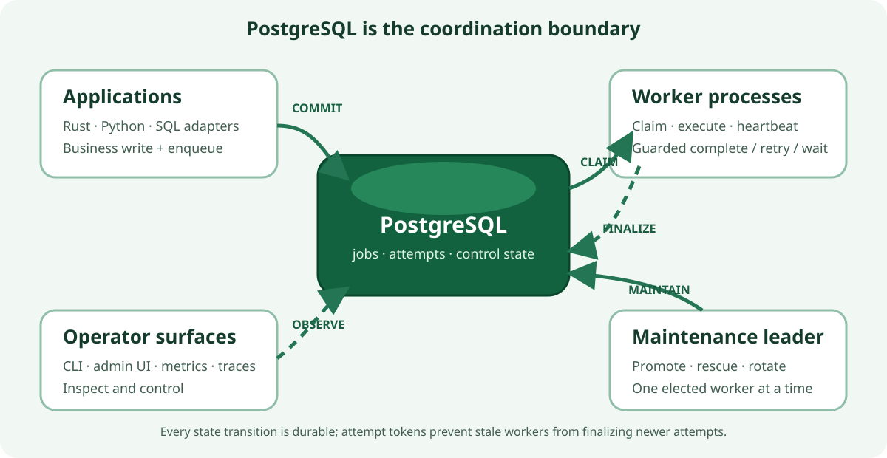
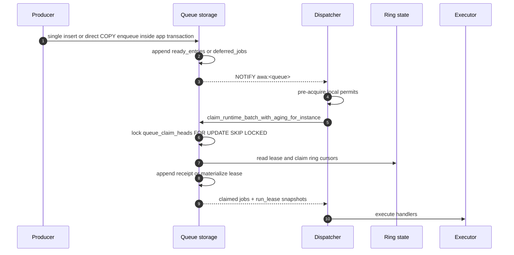
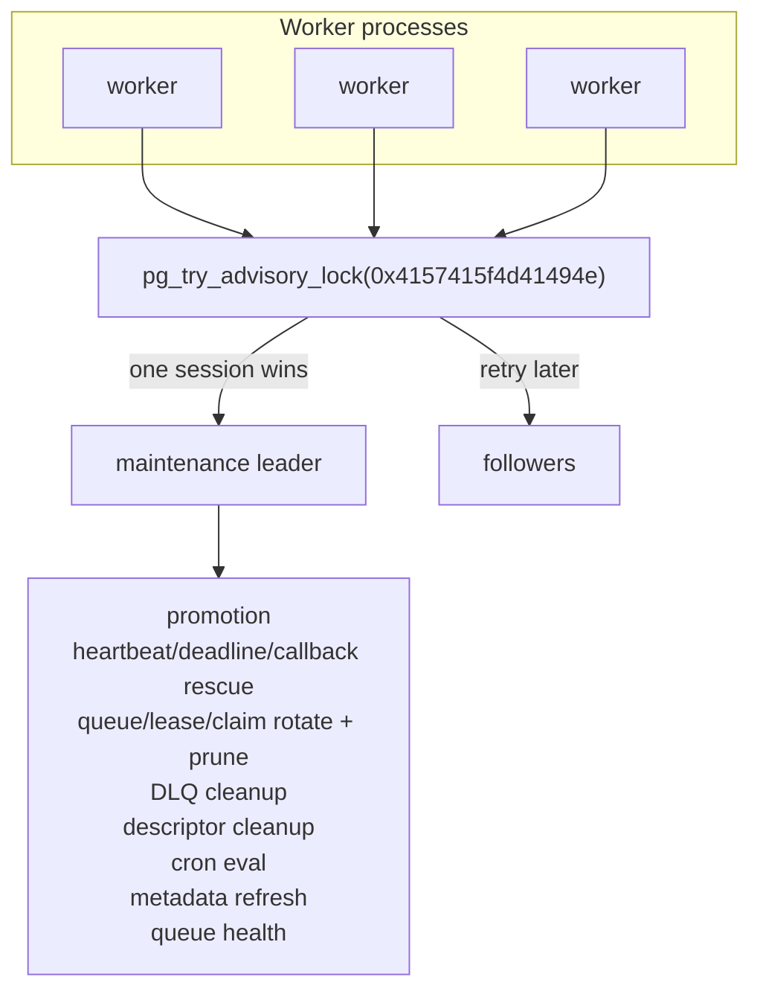

> For the complete AWA documentation index, see [`llms.txt`](../llms.txt).

# Awa Architecture Overview

Awa (Māori: river) is a Postgres-native background job queue for Rust and Python. Postgres is the sole infrastructure dependency: there is no Redis, RabbitMQ, sidecar scheduler, or separate lease store. Producers enqueue inside ordinary Postgres transactions, workers claim and complete jobs through the same database, and one elected worker runs cluster-wide maintenance.

Awa keeps application data and background work in one transactional system of record. Producers commit jobs with their business writes; workers claim attempts using lease-guarded PostgreSQL transitions; maintenance makes deferred work runnable, rescues abandoned attempts, and reclaims old ring partitions. There is no second broker whose acknowledgement state can diverge from the database transaction.



The diagram is the useful boundary: application processes produce work, worker processes execute it, and PostgreSQL is authoritative for both job state and coordination. The admin surface observes and controls that system; it is not part of the dispatch hot path.

For migration details see [Migrations](../migrations/index.md). For user-facing knobs see [Configuration](../configuration/index.md).

## Terms

- A **claim** is the storage transition that makes a ready job belong to one attempt. It increments `run_lease`; later completion, retry, rescue, and cancellation must match that lease number.
- A **deferred** job is not claimable yet. Future `run_at` jobs and snoozed jobs are `scheduled`; retry backoff and `RetryAfter` rows are `retryable`. Maintenance promotes due deferred rows into the ready ring.
- A **lane** is one ordered `(queue, priority, enqueue_shard)` stream. Raising the shard count creates more lanes for the same logical queue.
- A **lease** is the durable live-attempt row used when an attempt needs mutable execution state such as heartbeat, progress, callbacks, or deadlines.
- A **receipt** is the lighter claim evidence used for short attempts. A receipt can be a row in `lease_claims_*` or an item inside a compact `lease_claim_batches_*` row. Compact batch claims carry a claim-batch id and one-based item index so completion can validate the exact item without searching the batch by receipt range. Receipt attempts close through durable closure evidence: explicit closure rows for non-success and cold paths, or compact claim-local closure batches for successful hot-path completions. Successful completions also write compact terminal history that is exposed through `terminal_jobs`. Open receipts are derived by anti-joining row and batch claims against every closure-evidence family.
- A **segment** is a ring partition. Awa rotates segments and truncates whole old segments instead of vacuuming hot history row by row.
- A **ready tombstone** is an append-only marker that excludes an immutable ready row from future claims.

## Runtime Shape

The runtime is three cooperating layers:

| Layer | Owns | Notes |
| --- | --- | --- |
| Application code | Producer transactions, Rust handlers, Python handlers, optional HTTP worker targets | Enqueue can commit or roll back with the application's own writes. Rust and Python workers share the same storage engine. |
| Worker runtime | Dispatchers, executor tasks, guarded completion, per-process heartbeat refresh, maintenance leader election | Every worker process runs these services. Only one process wins the maintenance lock at a time. |
| Postgres | Queue state, execution state, control metadata, uniqueness, cron rows, runtime snapshots | Postgres is the coordination point for visibility, claim ownership, recovery, callbacks, and operator state. |

The important ownership split is simple: every worker can dispatch and heartbeat its own attempts, but exactly one elected maintenance leader runs cluster-wide promotion, rescue, queue/lease/claim ring rotation and prune, DLQ cleanup, descriptor cleanup, cron evaluation, metadata refresh, and queue-health publication.

While a storage transition is unfinalized, the leader promotes the deferred backlog and runs the rescue sweeps of *both* planes regardless of which engine it resolved at startup, so a drain cannot stall — and mid-flight jobs cannot wedge — on which runtime happens to hold the lock ([#456](https://github.com/hardbyte/awa/issues/456)). The extra passes are no-ops once the cluster is finalized.

## Deployment Model

- Awa assumes one shared Postgres database and any number of Rust or Python worker processes.
- Each process registers the queues and job kinds it can execute.
- Queue work is awakened by `LISTEN/NOTIFY` with polling as the fallback.
- The maintenance leader is elected inside the same worker fleet; no `pg_cron` or external scheduler is required.
- Long analytical reads should run on replicas or with disciplined timeouts, because long-lived primary transactions can delay best-effort partition prune.

## Storage Planes

Queue storage is the worker engine in 0.6. It is not one mutable jobs heap; it is split into queue, execution, and control planes so each plane carries the right kind of churn.

| Plane | Tables | Shape | Why it matters |
| --- | --- | --- | --- |
| Queue | `ready_entries_*`, `ready_claim_attempt_batches_*`, `ready_tombstones_*`, `ready_segments_*`, `done_entries_*`, `receipt_completion_batches_*`, `receipt_completion_tombstones_*`, `queue_terminal_count_deltas_*` | Ring partitions by `ready_slot` plus compact ready-segment and attempt-emission maps | Runnable and terminal rows stay append-first; emitted attempts leave compact queue-slot-local batch/range evidence so stale claim cursors do not need to scan claim-ring partitions; rare ready mutations append tombstones instead of deleting ready rows; claim routes through compact ready segments before reading ready rows; successful receipt completions can use compact batch terminal history; `done_entries` terminal-count changes append signed deltas, compact completions are counted from retained batches, and the whole segment is reclaimed by queue-ring prune. |
| Queue backlog | `deferred_jobs` | Plain table | Scheduled and retryable work stays out of the hot claim path until promotion. |
| Operator hold | `dlq_entries` | Plain table | DLQ rows are explicit operator backlog with retry, purge, and retention cleanup. |
| Receipt execution | `lease_claims_*`, `lease_claim_batches_*`, `lease_claim_closures_*`, `lease_claim_closure_batches_*` | Ring partitions by `claim_slot` | Short attempts avoid mutable lease rows. Zero-deadline hot claims can store many receipts in one compact claim-batch row; deadline-backed claims keep row-local claim evidence for indexed deadline rescue. A compact claim can still materialize into a lease if the worker later needs mutable attempt state. Each receipt gets an immutable `receipt_id`; compact completion validates row-local receipts by tuple identity and compact-batch receipts by returned batch id/index plus receipt id before writing closure batches. Stale-rescue and deadline-rescue scans use the same per-attempt advisory key before closing rescue-eligible receipts. |
| Materialized execution | `leases_*`, `attempt_state` | Lease ring plus mutable state table | Attempts escalate here when they need callback waiting, progress, or other mutable attempt state. |
| Control | `queue_lanes`, heads, ring-state tables, `queue_meta`, descriptors, runtimes, cron, uniqueness | Narrow metadata tables | Claim cursors, queue state, operator metadata, uniqueness, and liveness are kept separate from payload history. |

The asymmetry is intentional. Ready/done, lease, and receipt tables are ring-pruned because they are hot. Deferred and DLQ rows are backlog/hold tables with their own promotion, retry, purge, and retention paths. Control tables stay narrow because they are the coordination surface dispatchers and maintenance touch most often.

## Storage Surfaces

Most applications should use the Rust, Python, CLI, or UI APIs rather than querying queue-storage tables directly. The SQL objects still matter for operators, adapters, and incident read-outs, so Awa separates read surfaces from physical transition surfaces:

| Surface | Role | Consumer contract |
| --- | --- | --- |
| `awa.insert_job()` | Planned public v1 SQL producer capability under #342. It presents one stable request/result/error contract, uses a final `opts jsonb DEFAULT '{}'::jsonb` extension point, computes ADR-033 concurrency routing authoritatively from logical keys, and delegates to the active storage implementation. | Public SQL contract once shipped. Prefer configured direct COPY for trusted high-volume producers that accept ADR-043's broader privilege profile. |
| `awa.jobs` / `awa.insert_job_compat()` | Canonical compatibility plumbing used during the storage transition and by current Rust/Python adapters. When queue storage is active, the runtime does not claim or complete from `awa.jobs`; compatibility inserts route into the active backend, and SQL deletes of ready rows append ready tombstones. | `insert_job_compat` remains the transitional SQL producer contract listed in `docs/stability.md` until #342 ships `awa.insert_job()` and completes its migration/deprecation step. Its storage internals and other `_compat` helpers remain internal. |
| `{schema}.terminal_jobs` | Read-only hydrated view over queue-storage terminal history. It joins narrow `done_entries_*` rows and compact `receipt_completion_batches_*` rows back to retained `ready_entries_*` bodies. | Public read surface for SQL inspection and reporting of terminal queue-storage rows. It is not a write or transition surface. |
| `ready_entries_*` | Physical runnable queue ring. | Internal storage. Read only for low-level debugging; writes must go through Awa enqueue, claim, retry, cancel, or maintenance paths. |
| `ready_claim_attempt_batches_*` | Physical attempt-emission ledger keyed by ready slot/generation and lane ranges. | Internal storage. Claim writes one compact batch row in the same transaction as the receipt/lease claims; stale claim-cursor recovery treats covered lanes as durable evidence that those lanes already emitted `run_lease + 1`. Queue prune truncates it with the matching ready segment. |
| `ready_tombstones_*` | Physical ledger for ready lanes made unavailable by cancellation, priority aging, or similar out-of-band ready mutations. | Internal storage. Claim treats matching rows as spent lane evidence and exact-count paths skip them; maintenance truncates it with the matching ready segment. |
| `ready_segments_*` | Compact control-plane map from committed ready lane ranges to their ready slot/generation. | Internal storage. Claim uses it to choose the target ready segment before validating `ready_entries_*`; ranges are split when the lane-head `run_at` timestamp changes so claim-time priority aging stays exact as the cursor advances; queue prune truncates the matching ready-slot child. |
| `queue_claim_heads` ready-segment columns | Legacy nullable ready-slot/generation cache beside the per-lane claim cursor. | **Unused.** `claim_ready_runtime` resolves the target ready slot from `ready_segments_*` on every claim instead of caching it here — the per-claim `UPDATE` of this singleton row was the dominant dead-tuple source under a pinned MVCC horizon. The columns are retained for rolling-upgrade compatibility; dropping them is deferred to a major version. |
| `done_entries_*` | Physical terminal fact ring for failed, cancelled, non-receipt, and wide terminal rows. Ready-backed rows can intentionally omit duplicated body columns. | Internal storage. Direct readers must tolerate nullable duplicated body fields and must not assume all completed rows are present here; use `{schema}.terminal_jobs` for hydrated terminal rows. |
| `receipt_completion_batches_*` | Compact physical terminal history for successful receipt-backed completions. Each row stores one completion batch and expands through `{schema}.terminal_jobs`. | Internal storage. Optimized for hot-path append and queue-ring truncate; not a public query surface. Claim-closure proof for these completions lives in claim-slot-local `lease_claim_closure_batches_*` rows. SQL compatibility delete may scan retained compact batches by job id, but the hot path does not maintain a `job_ids` index for that cold operation. |
| `receipt_completion_tombstones_*` | Cold deletion ledger for completed rows synthesized from `receipt_completion_batches_*`. | Internal storage. SQL compatibility delete writes here so `terminal_jobs` can hide a compact completed row without mutating the compact batch. |
| `queue_terminal_count_deltas_*` | Append-only signed terminal-count ledger for `done_entries` mutations. `done_entries` inserts append positive deltas; retry, discard, DLQ move, and compatibility delete of `done_entries` rows append negative deltas. | Internal derived storage. Exact count reads include pending deltas plus retained compact completion batches minus compact tombstones; maintenance folds sealed-slot deltas into `queue_terminal_live_counts` and prune truncates the matching delta segment. |
| `queue_terminal_live_counts`, `queue_terminal_rollups` | Folded `done_entries` counters for retained queue segments and permanent terminal counters for pruned queue segments. | Internal derived storage. Rebuild live counts from `{schema}.done_entries` if the trust marker is cleared or after a counter incident; compact completions remain counted from retained batches until prune folds them into rollups. |
| `deferred_jobs` | Physical scheduled/retryable backlog table. | Internal storage. Promotion, retry, snooze, and cancellation own its transitions. |
| `dlq_entries` | Durable operator hold table for DLQ-enabled terminal failures. | Operator surface through CLI/UI/API; direct SQL inspection is reasonable, direct mutation is not. |
| `lease_claims_*` / `lease_claim_batches_*` / `lease_claim_closures_*` / `lease_claim_closure_batches_*` | Receipt-plane execution history for short attempts. | Internal storage. Live receipt attempts are row claims or compact batch items without durable closure evidence. Explicit closures cover non-success and cold paths; compact closure batches cover successful hot-path completions, expose a range-indexed receipt membership proof, and carry ready segment metadata for prune count proofs. Maintenance uses `claim_ring_slots` rescue cursors to keep stale and deadline scans bounded when closed receipt history cannot yet be truncated. |
| `leases_*` / `attempt_state` | Materialized execution state for heartbeat, callbacks, progress, and other mutable attempt data. | Internal storage. Runtime and rescue paths own mutations. |
| `queue_lanes`, queue heads, `{ring}_ring_rotations` ledgers, `{ring}_ring_state` config, `queue_terminal_rollup_deltas`, `queue_meta` | Claim cursors, enqueue heads, append-only rotation-ledger cursors (current cursor = max-generation row; ADR-040), ring config, pending prune-rollup deltas, and queue storage configuration. | Internal control surface except documented configuration fields such as `queue_meta.enqueue_shards`. If no `queue_meta` row exists for a queue, enqueue defaults to one shard; operators should configure shard counts with an UPSERT before load tests or production traffic. |
| descriptors, runtime snapshots, cron tables | Operator metadata and scheduler declarations. | Public through Awa APIs and UI; SQL reads are acceptable for reporting. Writes should go through the corresponding Awa APIs. |

ADR-019 is the storage-engine source of truth; ADR-023 supersedes it for the receipt plane, and ADR-026 refines terminal history:

- [ADR-019: Queue Storage Engine](../adr/019-queue-storage-redesign/index.md)
- [ADR-023: Receipt Plane Ring Partitioning](../adr/023-receipt-plane-ring-partitioning/index.md)
- [ADR-026: Narrow Terminal History](../adr/026-narrow-terminal-history/index.md)

For how the per-schema substrate is installed and who owns which objects, see [Queue-storage substrate](../queue-storage-substrate/index.md). The default `awa.*` substrate is materialised by `awa migrate`; custom queue-storage schemas are installed via the `awa.install_queue_storage_substrate()` SQL helper that `prepare_schema()` and `awa storage prepare-queue-storage-schema` both call into.

## Job Lifecycle

Core transitions:

| From | To | Trigger |
| --- | --- | --- |
| insert | `available` | Immediate enqueue. |
| insert | `scheduled` | Future `run_at`. |
| `scheduled` / `retryable` | `available` | Maintenance promotion when `run_at <= now()`. |
| `available` | `running` | Dispatcher claim; `run_lease` increments. |
| `running` | `completed` | Handler succeeds. |
| `running` | `retryable` | Handler returns a retryable failure, or `RetryAfter`. |
| `running` | `scheduled` | Handler snoozes; the attempt is not counted. |
| `running` | `waiting_external` | Handler parks for callback or sequential wait. |
| `waiting_external` | `running` | `resume_external` resumes a sequential wait. |
| `running` / `waiting_external` | `cancelled` | Handler cancel, admin cancel, rescue cancellation, or a transition-time re-schedule superseded by a newer unique-claim holder. |
| `running` / `waiting_external` | `failed` | Attempts exhausted, terminal error, or callback timeout exhaustion. |
| `failed` | `dlq_entries` | Optional per-queue DLQ routing. |

`run_lease` increments at claim time. Runtime mutations carry `(job_id, run_lease)`, so stale completions, retries, snoozes, cancels, and callback resumes lose after rescue, admin cancellation, or re-claim.

During a storage transition, a canonical re-schedule acquires any unique claim required by its destination state before its queue-storage successor can become executable. If a newer duplicate acquired the key while the running state was outside the job's `unique_states` mask, the newer job keeps the claim and the old attempt is recorded as cancelled terminal evidence with `rescheduled as duplicate`.

Terminal rows differ by storage backend:

- In queue storage, terminal history is reclaimed by queue-ring prune. Successful receipt-backed completions normally write compact rows in `receipt_completion_batches_*` and compact claim-local closure evidence in `lease_claim_closure_batches_*`; custom terminal payload snapshots live in `done_entries_*` so read surfaces preserve per-job metadata. Awa-owned provenance metadata from priority aging or queue/priority moves remains compact-safe. Failed, cancelled, non-receipt, and wide terminal snapshots live in `done_entries_*`. Ready-backed terminal rows are narrow: immutable job-body fields stay in the retained `ready_entries_*` row and public/admin reads hydrate through the storage surfaces described above. Unclaimed ready cancellation and priority aging do not delete ready rows; they append `ready_tombstones_*` rows so claim and exact-count paths skip the old lane until queue prune reclaims the segment. `done_entries` terminal-count changes append to `queue_terminal_count_deltas_*`; exact count reads include those pending deltas plus retained compact batches minus compact tombstones until maintenance folds sealed slots into compact live counters or prune folds the whole segment into permanent rollups. Receipt claims that materialize into `leases` for callbacks or mutable attempt state still complete through the lease-deleting path; that path identifies the lease by stable ready-lane and attempt keys because the lease ring may have rotated since the original claim.
- DLQ-enabled terminal failures are routed or moved into `dlq_entries` instead of ordinary terminal history; that table has explicit retention cleanup plus operator retry/purge.
- In the canonical compatibility path, terminal rows in `awa.jobs_hot` use row-by-row retention cleanup.

Progress is cleared on successful completion and preserved across retry, snooze, cancel, fail, and rescue. On queue storage, mutable progress snapshots live in `attempt_state` once an attempt first needs that mutable state; they are not rewrites of the immutable ready row. Cancellation is cooperative for live handlers: Rust handlers can poll `ctx.is_cancelled()`, Python handlers can poll `job.is_cancelled()`, and stale storage writes are still rejected by the `run_lease` guard if a handler misses the signal.

## Enqueue And Claim



Enqueue is transactional: if the producer's outer transaction rolls back, the job never becomes visible. Immediate jobs reserve a lane sequence range under a transaction-scoped lane lock, append to `ready_entries_*`, and append a compact `ready_segments` range for the committed lane sequence range; future scheduled or retryable jobs append to `deferred_jobs`. The lane lock is held until commit or rollback so a later producer cannot make lane `N+1` visible while lane `N` can still commit.

`deferred_jobs` is deliberately outside the claim path. The maintenance leader promotes due `scheduled` and `retryable` rows into `ready_entries_*` in batches and notifies the target queues. Cron schedules are just producers for ordinary jobs: when a schedule fires, the cron transaction records the fire and enqueues the job atomically, using `ready_entries_*` for immediate fires or `deferred_jobs` when the enqueue carries a future `run_at`.

There are two COPY-shaped producer paths:

- Direct queue-storage COPY is the high-throughput path: Rust producers use a configured `QueueStorage::enqueue_params_copy()`, and Python producers use `enqueue_many_copy()`. Direct-copy producers must use the same queue-storage configuration as the worker fleet, especially `queue_stripe_count` / `queue_storage_queue_stripe_count`.
- `insert_many_copy()` is the compatibility path. It stages rows with COPY, then takes one of two branches. If any staged row has a `unique_key`, every row is replayed through `POSTGRES_INSERT_JOB_SQL` inside a per-row savepoint so SQLSTATE `23505` can skip that duplicate without aborting the batch; that statement itself calls `awa.insert_job_compat()`. An all-non-unique batch uses one lateral `awa.insert_job_compat()` call per staged row without savepoints. Both branches therefore preserve cross-storage behavior. The planned `awa.insert_job()` public capability becomes the clean stable SQL contract after #342 ships its migration and conformance artifacts.

Claim is cursor-based rather than heap-scan based:

- `queue_meta.enqueue_shards` controls how many independent enqueue/claim head rows a queue has. The default is one shard. Raising it changes the ordering contract to FIFO within `(queue, priority, enqueue_shard)`, with no global ordering promise across shards.
- `queue_enqueue_heads` owns the sequence name for each `(physical queue, priority, enqueue_shard)` lane. Producers reserve lane sequence ranges under a transaction-scoped advisory lock keyed by that sequence name.
- `ready_segments` maps committed lane sequence ranges to the ready slot/generation that stores their immutable ready rows. Claim consults this compact map on every claim to resolve the target ready slot — ordered by `next_lane_seq` so the `(queue, priority, enqueue_shard, next_lane_seq, …)` index short-circuits at `LIMIT 1` — then validates the target ready head.
- `queue_claim_heads` advances monotonically during claim (via its lane sequence cursor) and is the authority for the next claimable lane position on the same shard-qualified lane. It still carries the legacy `ready_segment_*` cache columns, now unused — see the storage table above.
- The dispatcher pre-acquires execution permits before claiming, so every claimed `running` job has reserved local capacity.
- `PartitionedQueue` is a Rust and Python helper for mapping one hot logical queue to several ordinary physical queue names. The storage engine does not add a separate group table for this; each physical queue keeps the normal lane, lease, DLQ, descriptor, and terminal-history contract.
- Queue striping and bounded claimers reduce contention on very hot logical queues. Per-queue `claimers` can add dispatcher/claimer loops inside one runtime, but those loops share the queue's worker permits and rate limiter; they do not own jobs. Recovery still follows the receipt/lease state in Postgres.

Priority ordering is by effective priority first. Within one enqueue shard the lane sequence is FIFO; across enqueue shards, strict global lane order is not promised. With queue storage, priority aging is applied at claim time rather than by physically rewriting ready rows. The ready/done/lease partitions carry shard-aware lane indexes on `(queue, priority, enqueue_shard, lane_seq)` so deep backlog claim probes do not scan a non-shard-selective lane index and post-filter most rows.

## Completion And Callbacks

Handler results finalize through guarded storage transitions:

```text
handler result
    ├── Completed      -> close attempt, append receipt_completion_batches or done_entries
    ├── RetryAfter     -> close attempt, append deferred retry or terminal failure
    ├── Snooze         -> close attempt, append deferred_jobs without attempt bump
    ├── Cancel         -> close attempt, append done_entries(cancelled)
    ├── Terminal error -> close attempt, append done_entries(failed) or dlq_entries
    └── Retryable err  -> close attempt, append deferred retry or terminal failure
```

Two callback modes share the same attempt guard:

- **Parked callback.** The handler registers a callback token and returns `WaitForCallback`; the runtime frees the task slot and moves the attempt to `waiting_external` until a signed callback completes, fails, retries, or resumes it.
- **Sequential wait.** The handler calls `wait_for_callback()` and stays suspended; `resume_external` writes the callback result and returns the same attempt to `running` so the handler can continue.

Callback tokens are attempt-specific. Stale tokens and stale completions are rejected after a newer claim or terminal transition. The `awa-ui` HTTP callback receiver verifies `X-Awa-Signature` when `AWA_CALLBACK_HMAC_SECRET` is set; custom callback receivers must provide equivalent authentication. See [HTTP workers and callback signatures](../http-callbacks/index.md) for the concrete endpoint and signing contract.

## Recovery Model

Awa has three rescue paths:

- **Stale heartbeat rescue.** Each worker heartbeats the attempts it owns. The maintenance leader rescues attempts whose heartbeat is older than `heartbeat_staleness` (default 90s).
- **Hard deadline rescue.** Per-queue deadlines write `deadline_at` onto row-local receipt claims or lease rows. The maintenance leader closes expired attempts and routes them through the normal retry/fail/DLQ path.
- **Callback-timeout rescue.** Waiting attempts with expired callback timeouts are moved back through the same guarded finalization machinery.

Rescue closes the old attempt before making work available again. If the old handler later writes a completion, the `run_lease` guard rejects it as stale. When rescue happens in a process that still has the handler registered, the runtime also flips the in-memory cancellation flag.

## Partition Rotation And Reclamation

Queue storage has three independent rings, each advanced by the elected maintenance leader:

| Ring | Partitions | Default cadence | Rotate requires | Prune requires |
| --- | --- | --: | --- | --- |
| Queue | `ready_entries_*`, `ready_claim_attempt_batches_*`, `ready_tombstones_*`, `ready_segments_*`, `done_entries_*`, `receipt_completion_batches_*`, `receipt_completion_tombstones_*`, `queue_terminal_count_deltas_*` | `1000ms` | incoming ready/attempt/terminal/tombstone/segment/delta slot is empty | oldest non-current slot has no active leases, no retained ready rows at or ahead of their lane claim cursors, and no receipt claims without closure evidence; pending-ready, active-lease, and closure gates are checked before and after the bounded exclusive-lock path; terminal rows, compact completion batches, compact tombstones, emitted-attempt evidence, ready tombstones, ready-segment metadata, and pending `done_entries` count deltas in that ready segment are reclaimed with their retained ready bodies |
| Lease | `leases_*` | `1000ms` | incoming lease slot is empty | oldest initialized non-current lease slot is empty |
| Claim | `lease_claims_*`, `lease_claim_batches_*`, `lease_claim_closures_*`, `lease_claim_closure_batches_*` | matches queue ring | incoming claim-row/claim-batch/closure/closure-batch slot is empty | every row claim or compact claim-batch item in the oldest non-current slot has durable closure evidence; count proofs use compact closure-batch ready-segment metadata and skip conservatively when counts do not prove closure, and the open-claim proof is repeated after the bounded exclusive-lock path; stale-rescue cursors are reset when the slot is truncated |

The maintenance tick for each ring is deliberately small: attempt one rotate, then attempt one prune. If a partition is busy, blocked by a lock, current, or still live, the tick records a skipped/blocked outcome and tries again on a future interval.

Rotation is also gated on the ring having something to seal: if every child table of the *current* slot is empty, the tick reports `skipped_idle` and appends nothing, instead of advancing the cursor over nothing. An idle queue therefore stops rotating entirely — the cursor's slot and generation freeze until the next write lands — which keeps the ring bookkeeping free of dead-tuple churn under a pinned MVCC horizon. Once the oldest sealed generation has been pruned at that cursor, later idle ticks report `already_pruned` without repeating `TRUNCATE`; a new maintenance leader may conservatively repeat it once. A frozen generation on a quiet queue is expected and healthy; a frozen generation **with** rows accumulating (`skipped_busy` outcomes) is the pinned-ring condition to alert on.

**Cursor representation — the rotation ledger ([ADR-040](../adr/040-append-only-ring-rotation-ledger/index.md), #371).** Each ring cursor lives in an append-only `{ring}_ring_rotations` ledger, one row per rotation `(generation, slot, rotated_at)`. The **current cursor is the max-generation row** — a backward primary-key scan, O(1) — and rotation **appends** one row rather than UPDATEing a mutable singleton, so even a busy ring under a pinned MVCC horizon adds no dead bookkeeping tuple per tick. The append is a compare-and-swap on the `generation` primary key: a rotator whose observed cursor was already consumed loses the race and skips instead of double-advancing. Per-slot generations are derived (`slot = generation mod slot_count`, genesis `(0, 0)`). The maintenance leader trims each ledger to one full ring wrap on a horizon-gated fold, so the ledger stays bounded once the MVCC horizon clears.

This is the steady state in **ledger authority**. The rolling cutover uses a per-schema `ring_cursor_authority` row (`columns` | `ledger`), and `{schema}.ring_cursor(ring)` resolves the cursor accordingly. On upgrade a schema starts in **compat authority**, where the pre-0.7 `{ring}_ring_state.current_slot` / `generation` columns (and the per-slot `generation` column) remain authoritative and a 0.7 rotator serializes with any live 0.6.2 rotator on the singleton `FOR UPDATE`, CASes the columns, and shadows the ledger. Once the whole fleet is on 0.7 the authority flips one-way to `ledger` (`awa storage flip-ring-authority` or the maintenance auto-flip), reconciling the ledgers, poisoning the stale cursor/prune metadata, and database-enforcing rejection of later compat cursor updates. Fresh installs skip straight to ledger authority. The compat columns are dropped in 0.8.

The common safety pattern is:

1. Take the per-ring rotation advisory lock (`pg_try_advisory_xact_lock`) so a periodic tick skips under contention rather than queueing. This replaces the pre-ledger `FOR UPDATE` on the ring-state singleton for rotate ↔ prune ↔ delta-rollup serialization.
2. Choose the incoming or oldest initialized slot (from the ledger cursor).
3. Prove cheap skip gates before the exclusive-lock path. Queue prune checks active leases and pending ready lanes before receipt-closure proof; claim prune proves open-claim closure before child locks.
4. Take child-table `ACCESS EXCLUSIVE` locks with a short transaction-local `lock_timeout` so maintenance gives up promptly under contention.
5. Recheck the skip gates after acquiring the partition locks so rows that committed while the lock waited are visible before truncate.
6. `TRUNCATE` only partitions that are proven inactive; rotation appends the new cursor row to the ledger.

This is why queue storage's hot-path reclamation is a rotation-and-prune discipline, not ordinary row-by-row vacuum cleanup. Ordinary retention cleanup still exists for DLQ rows, stale descriptors, stale runtime snapshots, and the canonical compatibility path.

## Maintenance Leader



The advisory lock is session-scoped. If the leader process or database connection dies, Postgres releases the lock and another worker can win the next election. Heartbeat refresh is not leader-elected; only cluster-wide rescue and maintenance scans are.

## Operator Surfaces

### Descriptors And Runtime Liveness

Awa keeps operator-facing descriptor catalogs separate from per-job metadata:

- `awa.queue_descriptors` labels and documents queues.
- `awa.job_kind_descriptors` labels and documents job kinds.
- `awa.runtime_instances` reports live runtimes and descriptor hashes.

Descriptors are code-declared by Rust `ClientBuilder` or Python `AsyncClient`. Workers upsert their declared descriptors at startup and on runtime snapshot ticks. Admin APIs derive:

- **stale**: no live runtime has refreshed the descriptor recently.
- **drift**: live runtimes report conflicting descriptor hashes.

The maintenance leader deletes descriptor rows whose `last_seen_at` is older than `descriptor_retention` (default 30 days). Runtime liveness rows are garbage-collected on a shorter horizon.

### DLQ

The Dead Letter Queue is not a dispatchable `job_state`; it is a separate hold table for failed snapshots that need operator action.

- DLQ policy is per queue.
- Retry deletes the DLQ row and inserts a fresh ready/deferred entry with `attempt = 0` and `run_lease = 0`.
- Purge deletes the DLQ row permanently.
- DLQ retention is independent of ordinary terminal history.

### Cron

Periodic jobs are declared by worker code and synchronized to `cron_jobs`. Only the maintenance leader evaluates due schedules. Enqueue is atomic, so a crash between evaluation and insert cannot create half-visible work. Schedules carry a `paused_at` flag; the evaluator skips paused rows and the atomic enqueue CTE re-checks the flag inside the same UPDATE, so a pause asserted between the leader's read and its enqueue still takes effect.

## Observability And Correctness

Awa emits tracing spans and OpenTelemetry metrics for enqueue, claim, execution, completion, rescue, rotation, prune, DLQ, queue depth, runtime health, and callback flows. The Grafana dashboards in [`docs/grafana`](../grafana/index.md) use those metrics plus SQL panels for storage-level inspection.

Core safety invariants are modeled in TLA+:

| Model | Focus |
| --- | --- |
| [`AwaCore`](https://github.com/hardbyte/awa/blob/main/correctness/core/AwaCore.tla) | job lifecycle, retry/fail/cancel transitions, callback states |
| [`AwaBatcher`](https://github.com/hardbyte/awa/blob/main/correctness/core/AwaBatcher.tla) | guarded completion batching and stale-result rejection |
| [`AwaExtended`](https://github.com/hardbyte/awa/blob/main/correctness/protocol/AwaExtended.tla) | multi-instance shutdown, rescue, permit, leadership, and bounded fairness protocol |
| [`AwaSegmentedStorage`](https://github.com/hardbyte/awa/blob/main/correctness/storage/AwaSegmentedStorage.tla) | queue-storage lifecycle, rotate/prune safety, DLQ round-trip, receipt rescue |
| [`AwaSegmentedStorageRaces`](https://github.com/hardbyte/awa/blob/main/correctness/storage/AwaSegmentedStorageRaces.tla) | claim-vs-rotate/prune interleavings |
| [`AwaSegmentedStorageTrace`](https://github.com/hardbyte/awa/blob/main/correctness/storage/AwaSegmentedStorageTrace.tla) | concrete runtime trace acceptance for representative queue-storage flows |
| [`AwaShardedPrune`](https://github.com/hardbyte/awa/blob/main/correctness/storage/AwaShardedPrune.tla) | cross-shard ready/terminal prune matching by `enqueue_shard` |
| [`AwaStorageLockOrder`](https://github.com/hardbyte/awa/blob/main/correctness/storage/AwaStorageLockOrder.tla) | Postgres lock ordering across claim, rotate, and prune |
| [`AwaStorageTransition`](https://github.com/hardbyte/awa/blob/main/correctness/storage/AwaStorageTransition.tla) | queue-storage transition prepare, mixed-entry, finalize, and abort gates |
| [`AwaDeadTupleContract`](https://github.com/hardbyte/awa/blob/main/correctness/storage/AwaDeadTupleContract.tla) | hot-table reclaim-kind contract for partition truncate and bounded warm tables |
| [`AwaCbk`](https://github.com/hardbyte/awa/blob/main/correctness/races/AwaCbk.tla) | callback registration/resume/finalization races |
| [`AwaDispatchClaim`](https://github.com/hardbyte/awa/blob/main/correctness/races/AwaDispatchClaim.tla) | availability re-check at dispatch claim commit |
| [`AwaViewTrigger`](https://github.com/hardbyte/awa/blob/main/correctness/races/AwaViewTrigger.tla) | `awa.jobs` view trigger concurrency and version checks |
| [`AwaCron`](https://github.com/hardbyte/awa/blob/main/correctness/races/AwaCron.tla) | cron double-fire prevention under leader failover |

The storage model-to-code correspondence is maintained in [`correctness/storage/MAPPING.md`](https://github.com/hardbyte/awa/blob/main/correctness/storage/MAPPING.md). Runtime tests replay representative storage traces against these models, and the benchmark notes document long-horizon partition and dead-tuple validation for ADR-019 and ADR-023. Public SQL projections such as `awa.jobs` and admin counts are treated as refinements over the modeled storage state; they need code-level regression tests as well as TLA+ lifecycle coverage.

## Crate Structure

```text
awa (workspace)
├── awa-macros        proc macro: #[derive(JobArgs)]
├── awa-model         types, SQL, migrations, insert/admin/cron APIs
├── awa-worker        runtime: client, dispatcher, executor, heartbeat, maintenance
├── awa               facade crate re-exporting model + worker APIs
├── awa-testing       integration-test helpers
├── awa-ui            axum API + embedded React dashboard
├── awa-cli           migrations, admin, storage, and web UI CLI
└── awa-python        PyO3 Python bindings
```

`awa-model` owns schema and storage APIs. `awa-worker` owns runtime behavior. `awa` is the normal Rust facade. `awa-python` embeds the same worker runtime behind Python bindings, so mixed Rust/Python fleets share storage semantics.
