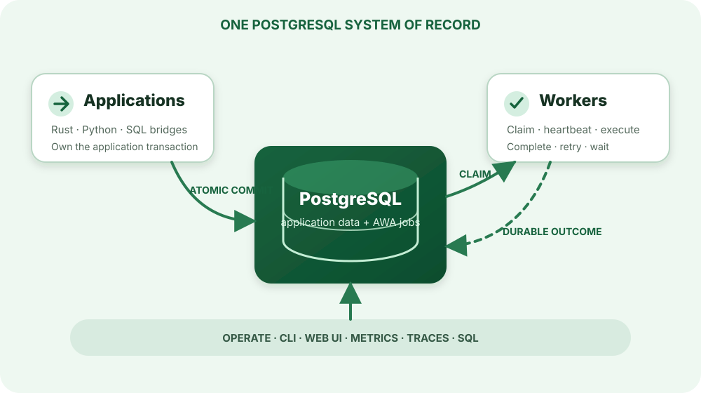

> For the complete AWA documentation index, see [`llms.txt`](../llms.txt).

# How AWA works

AWA is a library and schema, not a separate broker service. Producers, workers, and operational tools coordinate through PostgreSQL.

## The execution loop

1. A producer serializes typed arguments and inserts a job, optionally inside an application transaction.
2. A worker asks PostgreSQL for runnable work in a configured queue.
3. A claim records the attempt and establishes an ownership token. Other workers skip the claimed row.
4. The worker heartbeats while the handler runs.
5. Completion is accepted only while the worker still owns the claim. A retry, snooze, callback wait, failure, or completion becomes durable state.
6. If heartbeats stop, another worker can rescue the expired claim and run the job again.

This produces an **at-least-once** contract. The ownership guard prevents a stale worker from overwriting a newer attempt, but it cannot make an external side effect exactly once.

## Storage and runtime are separate responsibilities

- `awa-model` owns the schema, migrations, typed records, enqueue operations, and admin queries.
- `awa-worker` owns claiming, execution, heartbeats, retry scheduling, and graceful shutdown.
- `awa` is the Rust facade that joins those pieces.
- `awa-pg` exposes the same model and worker runtime to Python.
- `awa-cli` and the web UI provide migrations and operational inspection.

See the detailed [architecture](../architecture/index.md) and [queue storage substrate](../queue-storage-substrate/index.md) when you need implementation-level invariants.
