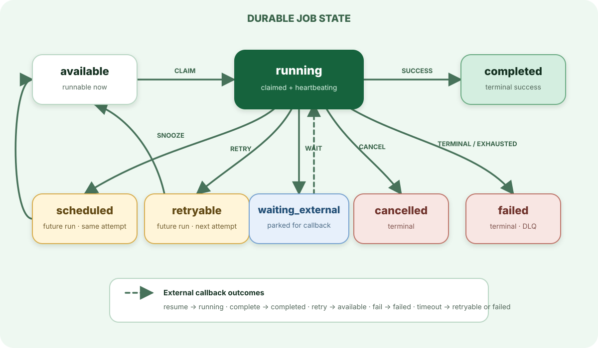

> For the complete AWA documentation index, see [`llms.txt`](../../llms.txt).

# Job lifecycle

A job moves through durable states in PostgreSQL. The handler returns the next outcome; AWA validates that the current worker still owns the claim before applying it.

## Common paths

`available → running → completed`
: The normal path. Claiming increments the attempt before the handler runs.

`running → retryable → available`
: A retry records the error and a future run time. Once due, the job is runnable again if attempts remain.

`running → scheduled → available`
: A snooze defers the same attempt. It is useful for polling an external system without consuming the retry budget.

`running → waiting_external → running`
: The handler parks while an external operation runs. A resuming callback stores the result and returns the job to `running`, where the still-live handler observes it.

`waiting_external → completed | failed`
: A callback may finalize the job directly. Callback policy failure also moves the job to `failed`.

`waiting_external → available`
: An explicit callback retry starts the job again from scratch and resets its attempt count. This is distinct from resuming the parked handler.

`waiting_external → retryable | failed`
: When a callback deadline expires, maintenance retries the job if attempts remain and otherwise fails it.

`running → failed | cancelled`
: Terminal outcomes. Failed jobs can be retained in the dead-letter queue according to policy.

## What crash recovery means

A running job is owned only for as long as its claim remains live. Heartbeats extend that claim. If the process stops, another worker can rescue the job after the claim expires. The original worker may still finish late, so completion writes are guarded by ownership and handlers must tolerate duplicate execution.

## Where to go next

- Configure attempts, delays, timeouts, and queue concurrency in [Configuration](../../configuration/index.md).
- Design idempotent effects with [Transactional enqueue](../transactional-enqueue/index.md).
- Inspect and redrive terminal failures with the [Dead-letter queue](../../dead-letter-queue/index.md).
- Use [Callbacks](../../http-callbacks/index.md) for externally completed work.
