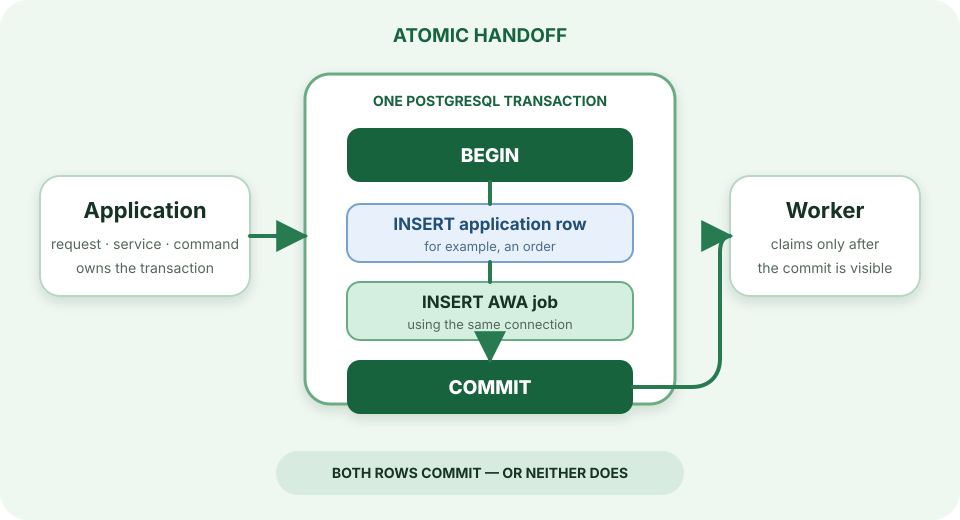

> For the complete AWA documentation index, see [`llms.txt`](../../llms.txt).

# Transactional enqueue

The central reason to keep AWA in PostgreSQL is atomic handoff. An application write and the job that follows it can commit together.

<div class="awa-diagram" markdown>

</div>

Without atomic enqueue, an application can commit business data and crash before publishing work—or publish work and then roll back the data the handler expects. AWA avoids that gap by accepting the application's existing database transaction.

## Rust

Pass an open `sqlx` transaction to the same insertion functions used with a pool:

```rust
let mut tx = pool.begin().await?;

sqlx::query("INSERT INTO orders (id, email) VALUES ($1, $2)")
    .bind(order_id)
    .bind(email)
    .execute(&mut *tx)
    .await?;

awa::insert_with(&mut *tx, &SendEmail { to: email.into() }, options).await?;
tx.commit().await?;
```

## Python

Use `awa.bridge` with the connection or session that owns the application transaction:

```python
async with session.begin():
    await session.execute(insert(Order).values(id=order_id, email=email))
    await awa.bridge.insert_job(
        session,
        SendEmail(to=email),
        queue="email",
    )
```

The bridge supports asyncpg, psycopg 3, SQLAlchemy, and Django. It does not move transaction ownership into AWA: the application still decides whether to commit or roll back. See [Bridge adapters](../../bridge-adapters/index.md) for exact driver behavior and tested examples.

!!! warning "Atomic enqueue does not make arbitrary side effects exactly once"
    AWA commits the job atomically with data in the same PostgreSQL transaction. A handler calling an external API still needs an idempotency key or another duplicate-safe design because delivery is at least once.
